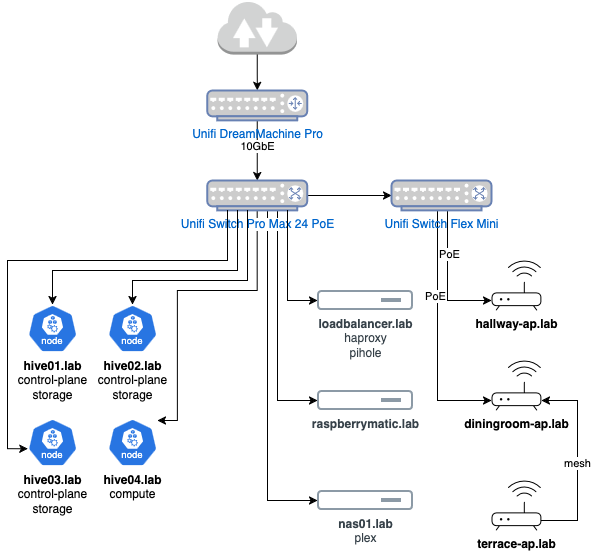

Why would anyone write about their homelab? Well, for one, so future me can remember why I set things up the way I did (and why it inevitably broke). But also, because homelabbing is a mix of art, science, and just enough chaos to keep things interesting. By sharing my setup, I hope others can learn from my mistakes, steal my good ideas, and maybe even tell me how to do things better. After all, half the fun of a homelab is comparing notes with fellow tinkerers who also think ‘just one more server’ is a reasonable life choice.

## Diagram

## Hardware Components

* 1x [Unifi DreamMachine Pro](https://eu.store.ui.com/eu/en/products/udm-pro)
* 1x [Unifi Switch Pro Max 24 PoE](https://eu.store.ui.com/eu/en/products/usw-pro-max-24-poe)
* 1x [Unifi Switch Flex Mini](https://eu.store.ui.com/eu/en/products/usw-flex-mini)
* 2x [Unifi UAP AC Pro](https://eu.store.ui.com/eu/en/products/uap-ac-pro)
* 1x [Unifi UAP U6 Pro](https://eu.store.ui.com/eu/en/products/u6-pro)
* k3s cluster:
    * 3x [Intel NUCs](https://www.intel.de/content/www/de/de/content-details/810135) (4 Cores, 32GB RAM, 2x NVMe 250GB)
    * 1x [Intel NUCs](https://www.intel.de/content/www/de/de/content-details/810135) (4 Cores, 16GB RAM, 1x NVMe 250GB)
* 1x [Apple MacMini 2012](https://support.apple.com/en-gb/111926)
* 1x [RaspberryPi 3b](https://www.raspberrypi.com/products/raspberry-pi-3-model-b/)
* 1x [RaspberryPi 4b](https://www.raspberrypi.com/products/raspberry-pi-4-model-b/)
* 1x [Avocent PM3000 PDU](https://www.vertiv.com/en-emea/support/software-download/power-distribution/avocent-managed-rack-pdu---pm-1000-2000-3000-software-downloads/)
* 1x [Synology 918+](https://global.synologydownload.com/download/Document/Hardware/DataSheet/DiskStation/18-year/DS918%2B/ger/Synology_DS918_Plus_Data_Sheet_ger.pdf) (4x 8TB)

## Software/Applications

* Apple MacMini: (loadbalancer.lab):
    * ha-proxy
    * pihole
* NUC's (4 node k3s cluster)
    * [alertmanager-to-github](https://github.com/pfnet-research/alertmanager-to-github): Sends alertmanager alerts to my homelab GitHub repository as issues (with autoclose and reopen)
    * [argocd](https://github.com/argoproj/argo-cd): Takes care of my applications for me
    * [audiobookshelf](https://github.com/advplyr/audiobookshelf): Small collection of audiobooks, mostly classics and tech
    * [cert-manager](https://github.com/cert-manager/cert-manager): Manages my Let's Encrypt Certificates
    * changedetection
    * ddclient
    * firefly-iii
    * freshrss
    * grafana
    * graylog
    * homeassistant
    * hugo-gavriliu-com
    * kasten-io
    * kube-prometheus-stack
    * kubernetes-dashboard
    * longhorn
    * mealie
    * metallb
    * netbox
    * ntfy
    * paperless-ngx
    * renovate
    * sealed-secrets
    * traefik
    * umami
    * vaultwarden
    * wger
* 1x RaspberryPi 3b:
    * raspberrymatic)
* 1x RaspberryPi 4b:
    * replacement pihole
* Synology 918+
    * Plex
    * Backup Location
    * Paperless-NGX export for quick access
